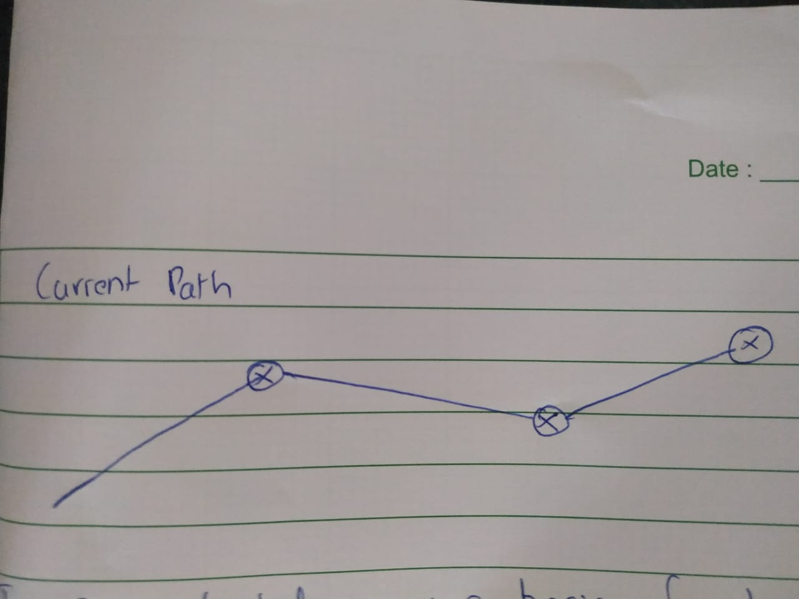
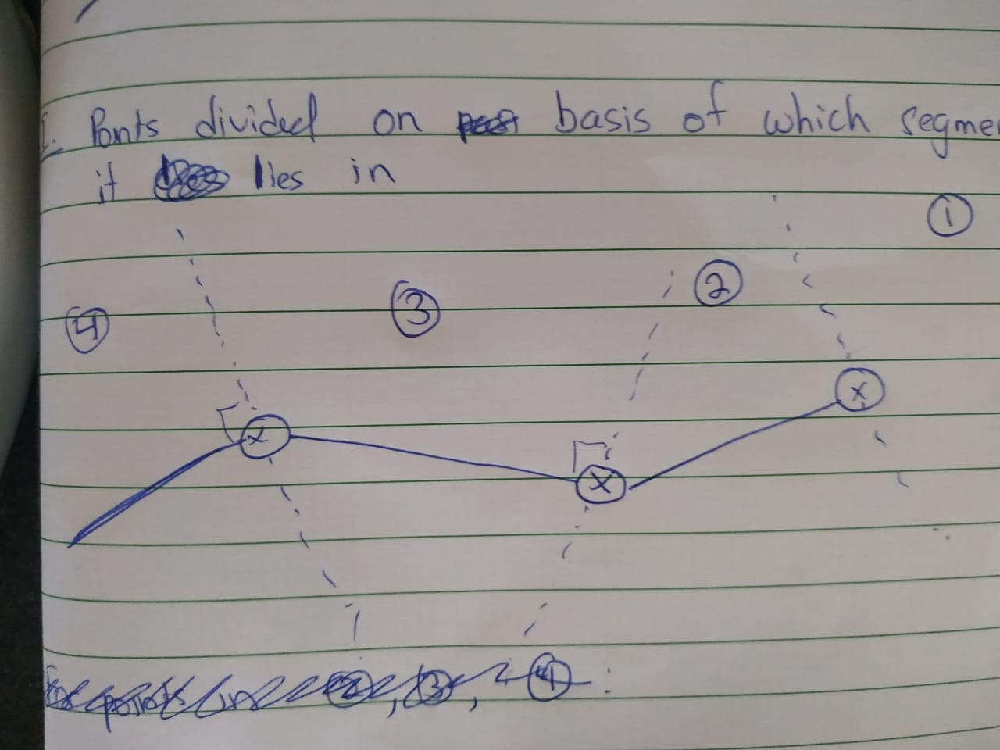
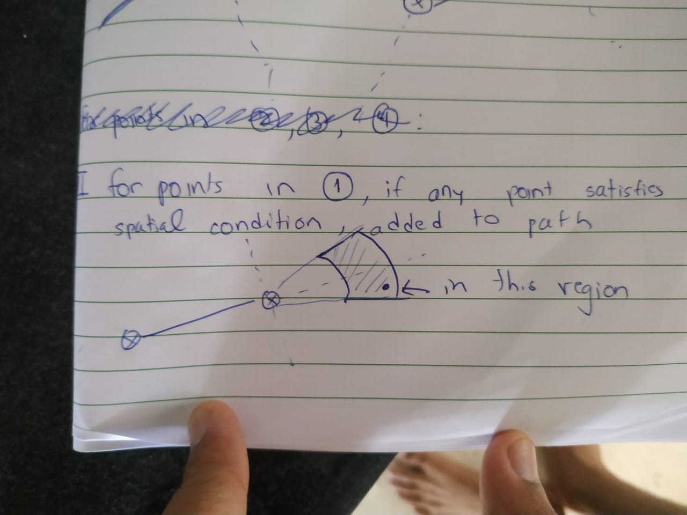
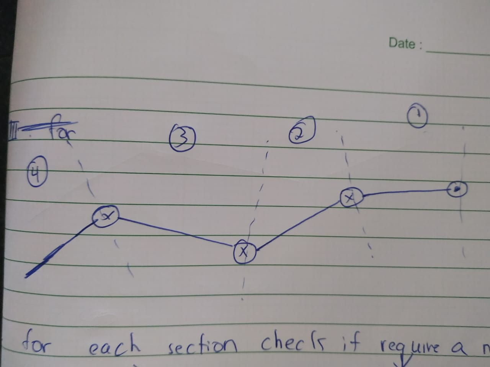
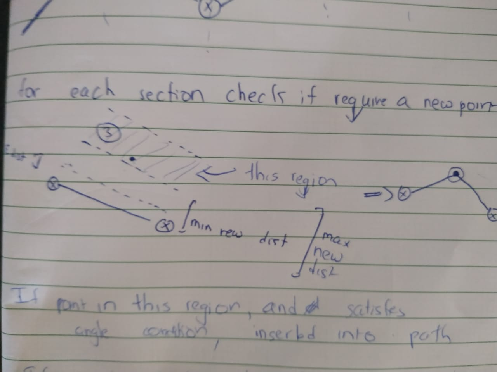
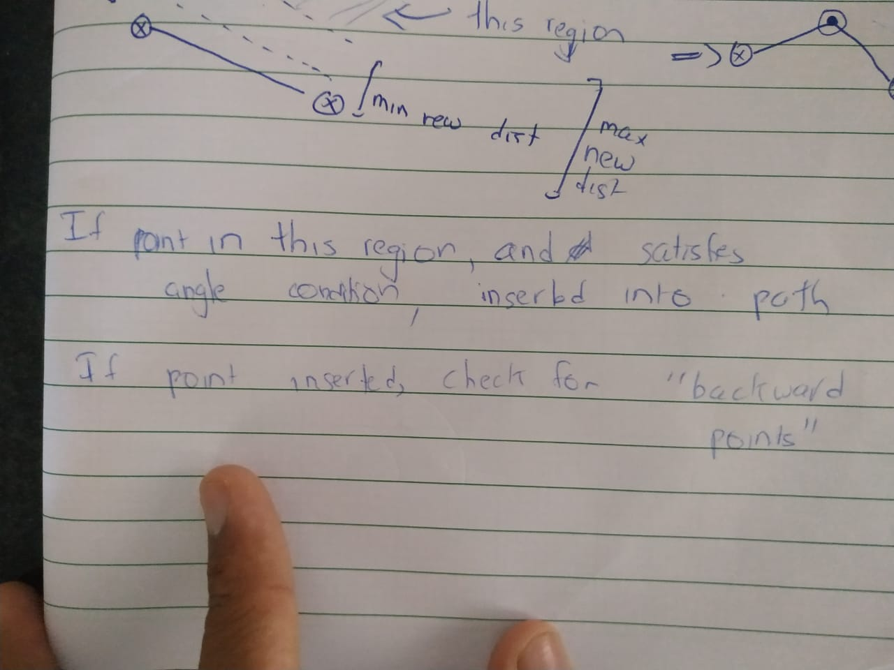

# What is this?

We are modeling the lanes as a set of points.

Instead of passing the lanes points as a point cloud from pixels,  
Store it as a set of line_segments (set of points). With every image, we take the point cloud. and fit the points around the existing model.
We also add new endpoints to the model.

# Sample:

# How does this work?
Two major components:

- lanes_mono: src/lanes/lanes_mono.cpp
- custom costmap layer src/lanes_layer/

## Lanes Mono
- Takes an image
- opencv pipeline
- Seperating points into which segment of the model they are part of
- Deciding whether a new point is required at the head of the path
- Modifiying existing segments of the line based on new data
- Removing incorrect Points.

## Custom costmap layer:
- Draws a set of linesegments on the costmap.
- Can adjust to changes in the linesegments.

# TODO: 
- Make the lanes aware of eachother, i.e. right lane doens't add new points from the region the left lane alread exists,
- Unify the two processing nodes to better let them be aware of eachother
- Fix documentation !!!

# Explanation with images
## Temporary

